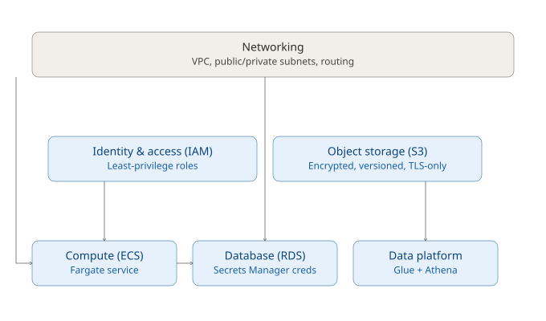

# Architecture

## Reading the diagram

**Networking is the foundation layer.** Every other module either needs
it directly (compute and database need subnets to run in) or doesn't
need it at all (IAM and data-platform's Glue/Athena resources are not
network-attached AWS services).

**IAM and storage are independent capability modules** -- neither
depends on networking or on each other. They're consumed by the modules
above them.

**Compute, database, and data platform are composition points** -- each
wires together outputs from the modules below it:

- **Compute** takes `vpc_id` / `subnet_ids` from networking and
  `role_arn` from IAM (as its task role), then creates its own
  execution role internally (see [ADR 0001](decisions/0001-module-boundaries.md)).
- **Database** takes `vpc_id` / `private_subnet_ids` from networking,
  and accepts a security group ID (typically compute's) as its
  `allowed_security_group_ids` -- shown as the compute -> database
  arrow.
- **Data platform** takes a bucket name/ARN from storage as the source
  of data to catalog and query.

## What this proves

Every arrow in the diagram is a Terraform module **output** feeding
another module's **input** -- there is no manual copying of resource
IDs anywhere in `environments/dev/main.tf`,
`environments/prod/main.tf`, or `examples/web-app-with-datastore/main.tf`.
This is the concrete evidence that COB's module boundaries are real
abstractions rather than independent, disconnected wrappers: the
platform composes.

## Why it's not "every AWS icon"

This diagram deliberately shows **capabilities and their relationships**,
not the ~35+ individual AWS resources those capabilities create (route
tables, security group rules, IAM policy documents, lifecycle
configurations, etc.). Those are documented per-module in
[`docs/modules/`](./modules/) for anyone who needs that level of detail.
The architecture diagram's job is to communicate *how the platform is
organised*, which is a different question from *what AWS resources
exist*.
